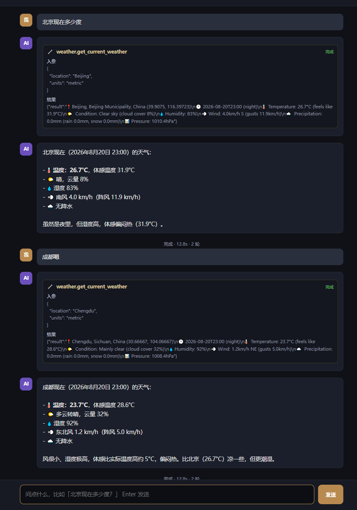

# Claude Agent Chat (WebSocket + stream-json)

A WebSocket chatbot whose backend is **Claude Code running as an agent**, with
the **weather MCP server** loaded so the agent can call `mcp__weather__*` tools
on demand. The browser streams the assistant's reply token-by-token.

## Demo

Weather queries with live tool calls (input + result) and streaming answers:



```
browser ──WebSocket──> server.js ──spawn──> claude -p --output-format stream-json
                                            (reads ~/.claude/settings.json → glm-5.2,
                                             loads user-scope weather MCP)
```

## Run

```bash
npm install            # only dependency: ws
node server.js         # serves http://127.0.0.1:8788
```

Open http://127.0.0.1:8788 and ask e.g. "北京现在多少度？" — the agent calls the
weather MCP tool and streams the answer.

## How it works

- `server.js` — HTTP server (serves `index.html`) + WebSocket server. On each
  user message it spawns `claude` with:
  ```
  claude -p "<msg>" --output-format stream-json --verbose \
         --include-partial-messages --allowedTools mcp__weather__*  \
         [--resume <session_id>]
  ```
  and relays each NDJSON line to the browser over WebSocket. `--resume` (the
  session_id captured from the first turn's `system/init` event) keeps
  multi-turn memory.
- `index.html` — chat UI. Renders the stream:
  - `stream_event` → `content_block_delta` / `text_delta` appended token-by-token.
  - `assistant` → tool_use blocks shown as 🔧 chips with input.
  - `user` → `tool_result` attached to the matching chip.
  - `result` → finalize, re-render streamed text as markdown.

## Streaming note

`--output-format stream-json` alone emits one coalesced `assistant` event per
message (text appears all at once). Adding **`--include-partial-messages`** makes
it also emit `stream_event` wrappers around the raw Anthropic SSE
(`content_block_delta` / `text_delta`), which is what gives real token streaming.

## Why stream-json and not ACP?

The original plan was the Agent Client Protocol (`@agentclientprotocol/
claude-agent-acp`), but that adapter is **blocked on this Windows machine**: it
spawns its bundled native binary (`@anthropic-ai/claude-agent-sdk-win32-x64/
claude.exe`) and the spawn fails with `spawn EFTYPE` (Windows rejects it).
Workarounds (`providers/set`, `CLAUDE_CODE_EXECUTABLE`) don't fix it. So this
uses Claude Code's own streaming protocol instead — same agent, same weather
MCP, streaming over WebSocket. If ACP's Windows binary bug is fixed upstream,
swapping `server.js` to speak ACP JSON-RPC (initialize → session/new →
session/prompt, relaying `session/update`) is the upgrade path.

## Weather MCP

The weather server lives at `../weather-mcp-server` (fastmcp + httpx on the free
Open-Meteo API, no key). It was installed into Claude Code's user config so any
Claude session auto-loads it:

```bash
claude mcp add -s user weather \
  -e PYTHONPATH=".../weather-mcp-server/src" -- \
  ".../.venv/Scripts/python.exe" -m weather_mcp.server
```

Verify with `claude mcp list` (should show `weather: ✔ Connected`).

## Config

Model and auth come from `~/.claude/settings.json` (Aliyun token-plan,
`glm-5.2`). No keys live in this project.
